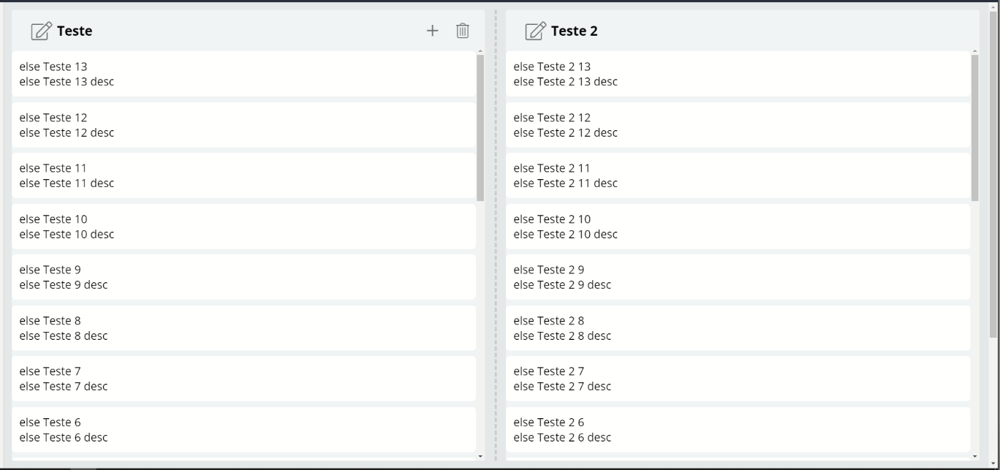

# **@viasoft/components/kanban** - Overview

**Overview** | [API](./api) | [Exemplos](./samples) 

O componente de kanban do SDK é utilizado com a diretiva`<app-kaban>` e implementa o layout e o comportamento de um kanban.

