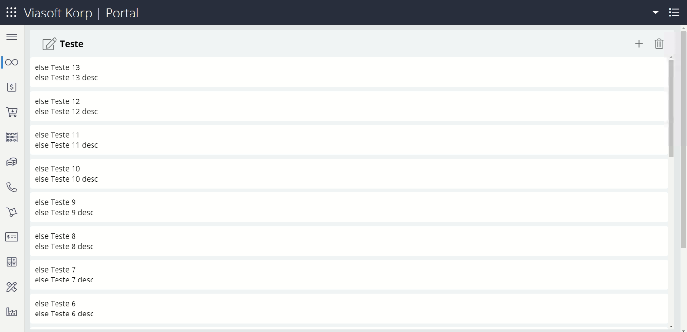
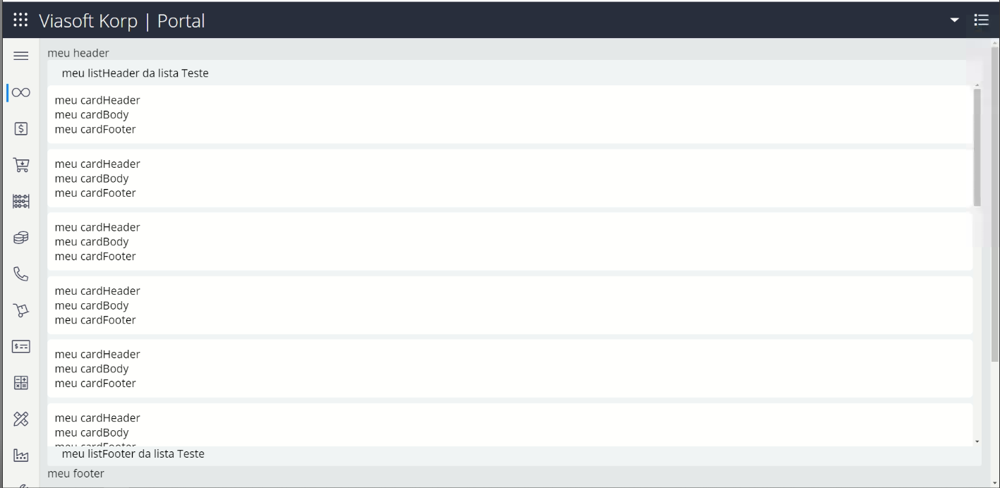

# **@viasoft/components/kanban**
[Overview](./index) | [API](./api) | **Exemplos**


### HTML## Uso Básico
```html
<vs-kanban [lists]="kanbanList" [service]="service" [cardSize]="40" [pageSize]="5"></vs-kanban>
```
### Typescript
```typescript
...
service = this.kanbanService;
  constructor(private kanbanService: CustomKanbanService) {
  }
  kanbanList = [new VsKanbanList({
    title: 'Teste',
    icon: 'edit',
    hasAddAction: true,
    hasDeleteAction: true
  })] as VsKanbanList[];
...
```

## Uso com Templates

### HTML
```html
<vs-kanban [lists]="kanbanList" [service]="service" [headerTemplate]="headerTemplate"
  [cardHeaderTemplate]="cardHeaderTemplate" [cardBodyTemplate]="cardBodyTemplate"
  [cardFooterTemplate]="cardFooterTemplate" [listHeaderTemplate]="listHeaderTemplate"
  [listFooterTemplate]="listFooterTemplate" [footerTemplate]="footerTemplate"
  [cardDragPlaceholderTemplate]="cardDragPlaceholderTemplate" [cardSize]="40" [pageSize]="5">
</vs-kanban>

<ng-template #cardDragPlaceholderTemplate let-card="card"> meu card placeholder </ng-template>
<ng-template #headerTemplate> meu header </ng-template>
<ng-template #footerTemplate> meu footer </ng-template>
<ng-template #listHeaderTemplate let-list="list">meu listHeader da lista {{list.title}} </ng-template>
<ng-template #listFooterTemplate let-list="list"> meu listFooter da lista {{list.title}} </ng-template>
<ng-template #cardHeaderTemplate>meu cardHeader </ng-template>
<ng-template #cardBodyTemplate> meu cardBody </ng-template>
<ng-template #cardFooterTemplate> meu cardFooter </ng-template>
```
### Typescript
```typescript
...
service = this.kanbanService;
  constructor(private kanbanService: CustomKanbanService) {
  }
  kanbanList = [new VsKanbanList({
    title: 'Teste',
    icon: 'edit',
    hasAddAction: true,
    hasDeleteAction: true
  })] as VsKanbanList[];
...
```

